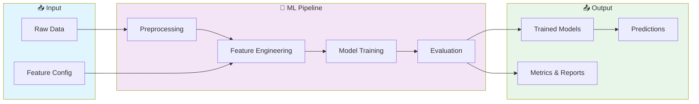
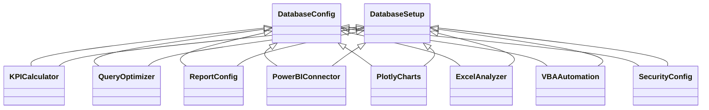

# 📊 Ibm Data Analyst Capstone

> IBM Data Analyst Professional Certificate Capstone Project

[](https://img.shields.io/badge/)
[](https://img.shields.io/badge/)
[](https://img.shields.io/badge/)
[](https://img.shields.io/badge/)
[](https://img.shields.io/badge/)
[](https://img.shields.io/badge/)
[](LICENSE)

[English](#english) | [Português](#português)

---

## English

### 🎯 Overview

**Ibm Data Analyst Capstone** is a production-grade Python application complemented by SQL that showcases modern software engineering practices including clean architecture, comprehensive testing, containerized deployment, and CI/CD readiness.

The codebase comprises **4,882 lines** of source code organized across **26 modules**, following industry best practices for maintainability, scalability, and code quality.

### ✨ Key Features

- **🔄 Data Pipeline**: Scalable ETL with parallel processing
- **✅ Data Validation**: Schema validation and quality checks
- **📊 Monitoring**: Pipeline health metrics and alerting
- **🔧 Configurability**: YAML/JSON-based pipeline configuration
- **🏗️ Object-Oriented**: 27 core classes with clean architecture

### 🏗️ Architecture





### 🚀 Quick Start

#### Prerequisites

- Python 3.12+
- pip (Python package manager)

#### Installation

```bash
# Clone the repository
git clone https://github.com/galafis/ibm-data-analyst-capstone.git
cd ibm-data-analyst-capstone

# Create and activate virtual environment
python -m venv venv
source venv/bin/activate  # On Windows: venv\Scripts\activate

# Install dependencies
pip install -r requirements.txt
```

#### Running

```bash
# Run the application
python src/main.py
```

### 🧪 Testing

```bash
# Run all tests
pytest

# Run with coverage report
pytest --cov --cov-report=html

# Run specific test module
pytest tests/test_main.py -v

# Run with detailed output
pytest -v --tb=short
```

### 📁 Project Structure

```
ibm-data-analyst-capstone/
├── config/        # Configuration
│   ├── database.py
│   └── reports.py
├── data/
│   └── README.md
├── docs/          # Documentation
│   ├── api_documentation.md
│   ├── api_reference.md
│   ├── development_guide.md
│   └── user_guide.md
├── sql/
│   ├── create_tables.sql
│   ├── data_analysis.sql
│   └── etl_process.sql
├── src/          # Source code
│   ├── business_intelligence/
│   │   ├── forecast_engine.py
│   │   ├── kpi_calculator.py
│   │   └── trend_analyzer.py
│   ├── excel/
│   │   ├── excel_analyzer.py
│   │   ├── pivot_generator.py
│   │   └── vba_automation.py
│   ├── sql/
│   │   ├── etl_processor.py
│   │   ├── query_optimizer.py
│   │   └── sql_analyzer.py
│   ├── utils/         # Utilities
│   │   └── data_quality.py
│   ├── visualization/
│   │   ├── dashboard_builder.py
│   │   ├── plotly_charts.py
│   │   ├── powerbi_connector.py
│   │   └── tableau_connector.py
│   ├── data_analyst_platform.py
│   ├── main_platform.py
│   └── setup_database.py
├── tests/         # Test suite
│   ├── unit/
│   │   └── test_placeholder.py
│   ├── __init__.py
│   ├── performance_test.py
│   └── test_platform.py
├── LICENSE
├── README.md
└── requirements.txt
```

### 🛠️ Tech Stack

| Technology | Description | Role |
|------------|-------------|------|
| **Python** | Core Language | Primary |
| **NumPy** | Numerical computing | Framework |
| **Pandas** | Data manipulation library | Framework |
| **Plotly** | Interactive visualization | Framework |
| **scikit-learn** | Machine learning library | Framework |
| **SQLAlchemy** | SQL toolkit and ORM | Framework |
| SQL | 3 files | Supporting |

### 🤝 Contributing

Contributions are welcome! Please feel free to submit a Pull Request. For major changes, please open an issue first to discuss what you would like to change.

1. Fork the project
2. Create your feature branch (`git checkout -b feature/AmazingFeature`)
3. Commit your changes (`git commit -m 'Add some AmazingFeature'`)
4. Push to the branch (`git push origin feature/AmazingFeature`)
5. Open a Pull Request

### 📄 License

This project is licensed under the MIT License - see the [LICENSE](LICENSE) file for details.

### 👤 Author

**Gabriel Demetrios Lafis**
- GitHub: [@galafis](https://github.com/galafis)
- LinkedIn: [Gabriel Demetrios Lafis](https://linkedin.com/in/gabriel-demetrios-lafis)

---

## Português

### 🎯 Visão Geral

**Ibm Data Analyst Capstone** é uma aplicação Python de nível profissional, complementada por SQL que demonstra práticas modernas de engenharia de software, incluindo arquitetura limpa, testes abrangentes, implantação containerizada e prontidão para CI/CD.

A base de código compreende **4,882 linhas** de código-fonte organizadas em **26 módulos**, seguindo as melhores práticas do setor para manutenibilidade, escalabilidade e qualidade de código.

### ✨ Funcionalidades Principais

- **🔄 Data Pipeline**: Scalable ETL with parallel processing
- **✅ Data Validation**: Schema validation and quality checks
- **📊 Monitoring**: Pipeline health metrics and alerting
- **🔧 Configurability**: YAML/JSON-based pipeline configuration
- **🏗️ Object-Oriented**: 27 core classes with clean architecture

### 🏗️ Arquitetura


### 🚀 Início Rápido

#### Prerequisites

- Python 3.12+
- pip (Python package manager)

#### Installation

```bash
# Clone the repository
git clone https://github.com/galafis/ibm-data-analyst-capstone.git
cd ibm-data-analyst-capstone

# Create and activate virtual environment
python -m venv venv
source venv/bin/activate  # On Windows: venv\Scripts\activate

# Install dependencies
pip install -r requirements.txt
```

#### Running

```bash
# Run the application
python src/main.py
```

### 🧪 Testing

```bash
# Run all tests
pytest

# Run with coverage report
pytest --cov --cov-report=html

# Run specific test module
pytest tests/test_main.py -v

# Run with detailed output
pytest -v --tb=short
```

### 📁 Estrutura do Projeto

```
ibm-data-analyst-capstone/
├── config/        # Configuration
│   ├── database.py
│   └── reports.py
├── data/
│   └── README.md
├── docs/          # Documentation
│   ├── api_documentation.md
│   ├── api_reference.md
│   ├── development_guide.md
│   └── user_guide.md
├── sql/
│   ├── create_tables.sql
│   ├── data_analysis.sql
│   └── etl_process.sql
├── src/          # Source code
│   ├── business_intelligence/
│   │   ├── forecast_engine.py
│   │   ├── kpi_calculator.py
│   │   └── trend_analyzer.py
│   ├── excel/
│   │   ├── excel_analyzer.py
│   │   ├── pivot_generator.py
│   │   └── vba_automation.py
│   ├── sql/
│   │   ├── etl_processor.py
│   │   ├── query_optimizer.py
│   │   └── sql_analyzer.py
│   ├── utils/         # Utilities
│   │   └── data_quality.py
│   ├── visualization/
│   │   ├── dashboard_builder.py
│   │   ├── plotly_charts.py
│   │   ├── powerbi_connector.py
│   │   └── tableau_connector.py
│   ├── data_analyst_platform.py
│   ├── main_platform.py
│   └── setup_database.py
├── tests/         # Test suite
│   ├── unit/
│   │   └── test_placeholder.py
│   ├── __init__.py
│   ├── performance_test.py
│   └── test_platform.py
├── LICENSE
├── README.md
└── requirements.txt
```

### 🛠️ Stack Tecnológica

| Tecnologia | Descrição | Papel |
|------------|-----------|-------|
| **Python** | Core Language | Primary |
| **NumPy** | Numerical computing | Framework |
| **Pandas** | Data manipulation library | Framework |
| **Plotly** | Interactive visualization | Framework |
| **scikit-learn** | Machine learning library | Framework |
| **SQLAlchemy** | SQL toolkit and ORM | Framework |
| SQL | 3 files | Supporting |

### 🤝 Contribuindo

Contribuições são bem-vindas! Sinta-se à vontade para enviar um Pull Request.

### 📄 Licença

Este projeto está licenciado sob a Licença MIT - veja o arquivo [LICENSE](LICENSE) para detalhes.

### 👤 Autor

**Gabriel Demetrios Lafis**
- GitHub: [@galafis](https://github.com/galafis)
- LinkedIn: [Gabriel Demetrios Lafis](https://linkedin.com/in/gabriel-demetrios-lafis)
